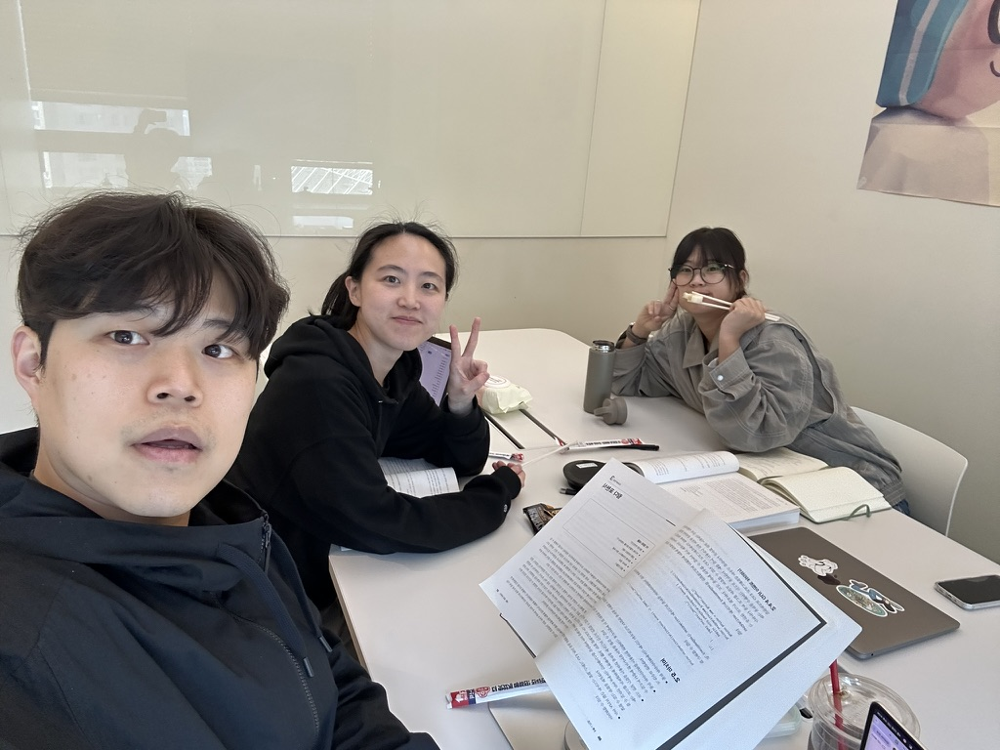
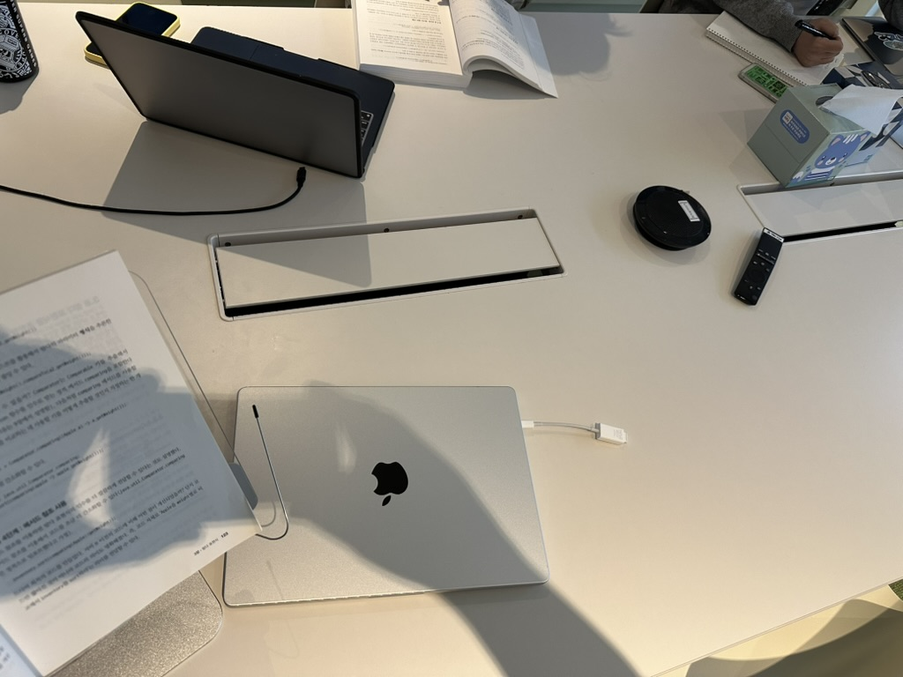
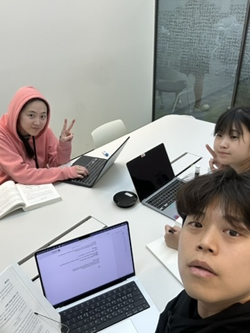
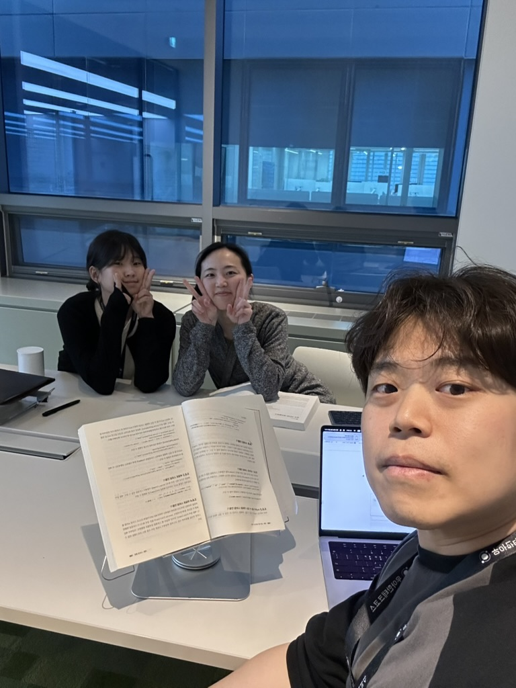

# 2025-moja-study

## 📚 스터디 소개

모던 자바 인 액션 북 스터디

---

## 🎯 스터디 목표

- 무심코 사용하던 자바를 깊게 이해하여 기본기가 탄탄한 크루로 성장
- 사소한 코드 한 줄에도 본인의 주관을 담을 수 있는 크루로 성장

---

## 🕖 스터디 진행 일정

- 매주 2회 진행
  - 화요일 : 핸드 푸드를 먹으며 진행 (18:00 시 ~ )
  - 금요일 : 일과 시간에 진행 (16: 00 시 ~ )
  - 1시간 독서 후, 지식 공유 (공유 시간은 자율)

- 매 회차 별, 20~30P 진행

---

## 📅 진행 방식

### 1️⃣ 독서

- 1시간 동안 회차 별 정해진 양의 챕터를 각자 읽습니다

### 2️⃣ 지식 공유

- 읽은 내용을 기반으로 서로 지식을 공유합니다
  
**[ 공유 사항 ]**

1. 이해가 가지 않는 내용
2. 새로 알게 된 내용
3. 말로 설명해보고 싶은 내용

### 3️⃣ 학습 내용 출력

- 매 챕터를 완독하면, 챕터 맨 앞에 있는 **[이 장의 내용]** 에 대해서 직접 답해보고 공유한다.

🚨규칙🚨

**책을 읽으며 보완해야 하는 지식을 찾는 과정이다 그렇기 때문에 직접 답하는 과정에서 책을 확인하지 않는다.**

___

## ✅ 주차 별 진행 상황

|    | 회차  | 진행 챕터               | 참여자              | 진행 일자             | 진행 장소 | 인증샷                                      |
|----|-----|---------------------|------------------|-------------------|-------|------------------------------------------|
| ✅ | 1회차 | Chapter 1.1 ~ 1.2.1 | 히포, 줄리, 히로 | 2025.04.18(금) 16시 | 임팩트방  |                                          |
| ✅️ | 2회차 | Chapter 1.2.2 ~ 1.7 | 히포, 줄리, 히로 | 2025.04.22(화) 18시 | 임팩트방  |   |
| ✅️ | 3회차 | Chapter 3.1 ~ 3.7   | 히포, 줄리, 히로 | 2025.05.08(목) 16시 | 임팩트방  |  |
| ✅️ | 4회차 | Chapter 3.8 ~ 4.3   | 히포, 줄리, 히로 | 2025.05.09(금) 16시 | 어드레스방 |  |
| ✅️ | 5회차 | Chapter 4.4 ~ 5.4   | 히포, 줄리, 히로 | 2025.05.16(금) 17시 | 톱오브스윙방 |  |
| ✅️ | 6회차 | Chapter 5.5 ~ 5.7   | 히포, 줄리, 히로 | 2025.05.20(화) 18시 | 톱오브스윙방 |  |
| ✅️ | 6회차 | Chapter 5.8 ~ 6.1   | 히포, 줄리, 히로 | 2025.05.23(화) 18시 | 임팩트방   |                                          |

---
## 🧢 스터디원

|  |  |  |
|:---:|:---:|:---:|
| [히포](https://github.com/kwonkeonhyeong) | [줄리](https://github.com/jbilee) | [히로](https://github.com/jin409) |
